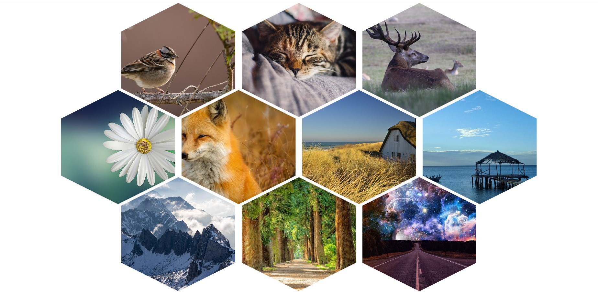
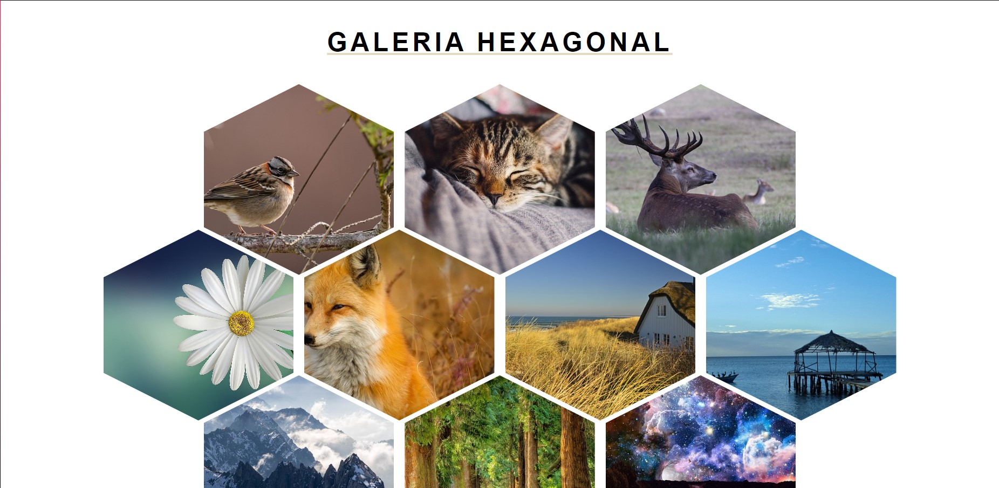
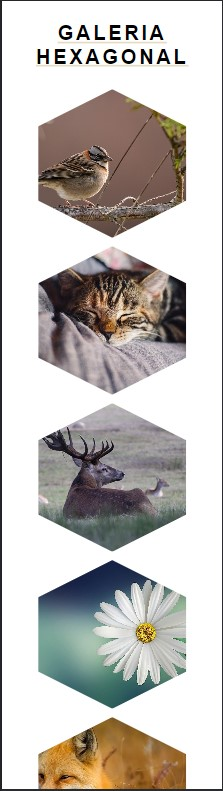
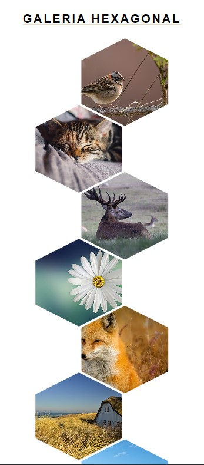
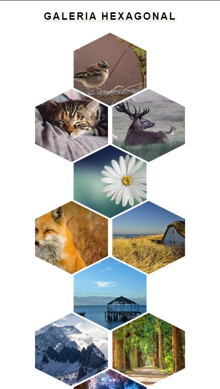
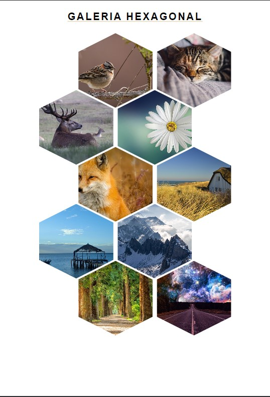
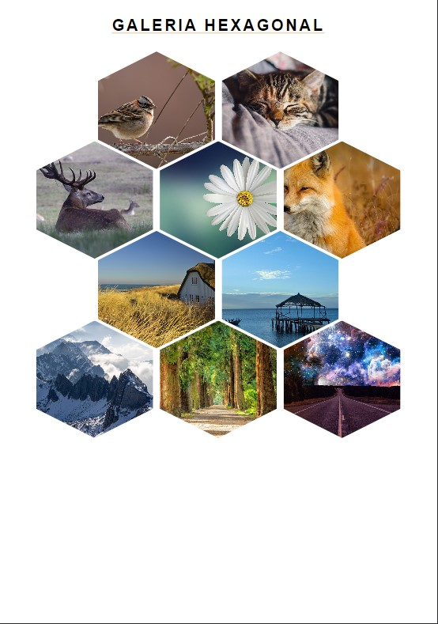
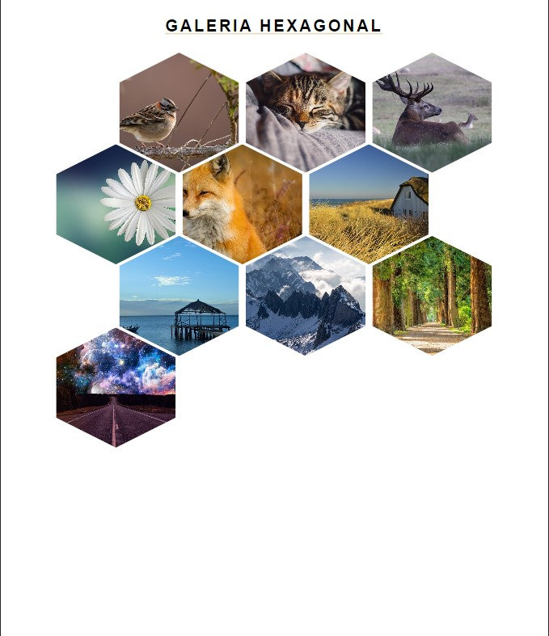

# Galeria-de-Imagenes-Hexagonal-o-Panal
Muestra de un diseño de Galería de Imágenes con forma de Hexágono o Panal e Abejas, con caracter responsivo manteniendo el orden de paneles ordenados 
en el diseño de imagenes, diseño de aplicación hecho con HTML y CSS.

  
    
  
    
  

## ¿Cuál es el fin de este proyecto?
Es una simple pagina hecha en HTML, CSS y JavaScript. 
Su objetivo no es mas que el aprendisaje y practica de herramientas que nos puede proporcionar JavaScript.

## ¿Puedo Probarlo en Linea? 
Si, Puedes probarlo en linea haciendo click [aqui](https://carlosorellana00.github.io/Galeria-de-Imagenes-Hexagonal-o-Panal/)

## ¿Cómo puedo probarlo de manera local en mi equipo?
puede copiarse directamente desde git a traves de comando o descargarse en un archivo Zip, el proyecto no requiere de ningun servicio de servidor para correrse
de manera local en una computadora.

## Imagenes Refrenciales:

    

    

## Imagenes de manejo responsivo:

    

    

    

    

    

    

## Agradecimientos y Referencias:

- [Autor Original -> dinora PC {}](https://www.youtube.com/c/dinoraPCode)
- [Video Tutorial -> Cómo hacer una galería de imágenes en HTML y CSS 💪🏾 | Galería HEXAGONAL RESPONSIVE 🤩](https://www.youtube.com/watch?v=jDTKPSKp9dY)
